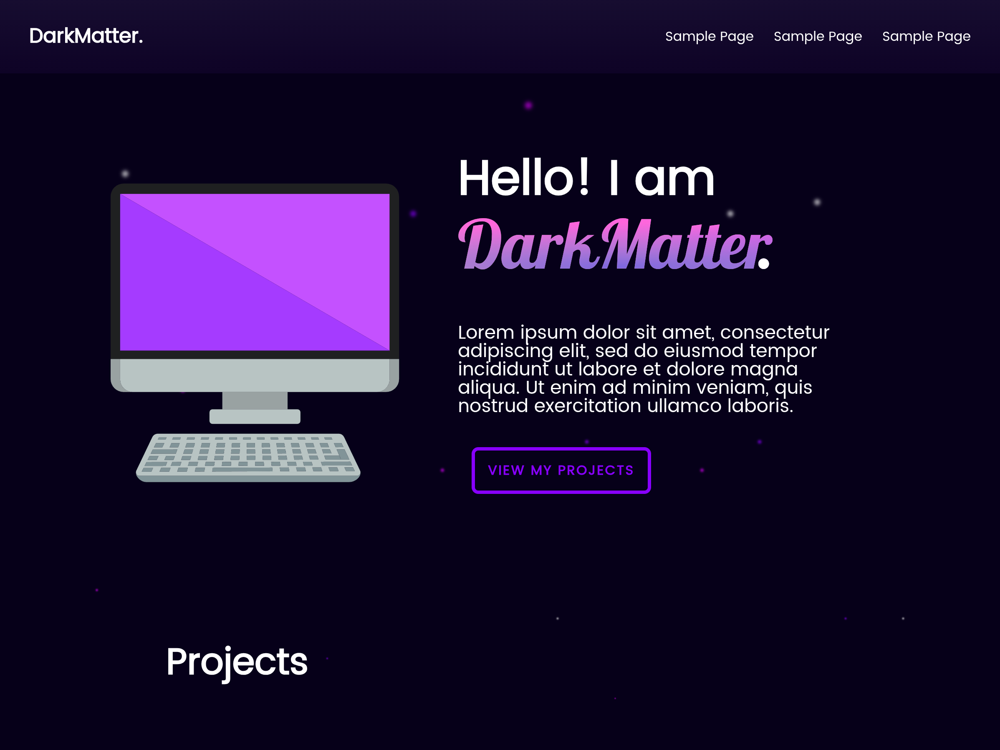

# DarkMatter WordPress Theme

A modern and highly customizable WordPress theme designed for performance and aesthetic appeal.

## Description
The DarkMatter theme provides a robust foundation for building professional websites with WordPress. It is built with a focus on clean code, modular design, and extensibility, making it easy to adapt to various project requirements.

## Installation

1.  **Download:** Clone the repository.
2.  **Upload:** Upload the `DarkMatter-WordPress-Theme` folder to your WordPress installation's `wp-content/themes/` directory.
3.  **Activate:** Go to **Appearance > Themes** in your WordPress dashboard and activate the "DarkMatter" theme.

## Usage

After activation, the theme can be customized via the WordPress Block Editor (**Appearance > Editor**) and by utilizing its block patterns and templates.

### Development

This theme uses modern development workflows including:
-   **Webpack:** For compiling assets (CSS, JS).
-   **Sass:** For CSS preprocessing.
-   **JavaScript (ES6+):** For interactive elements.
-   **Composer:** For PHP dependency management.
-   **npm/Yarn:** For Node.js package management.

To set up the development environment:

1.  Navigate to the theme directory: `cd wp-content/themes/DarkMatter-WordPress-Theme`
2.  Install Composer dependencies: `composer install`
3.  Install Node.js dependencies: `npm install` 
4.  Compile assets:
    -   Development: `npm run dev` 
    -   Production: `npm run build` 

## Contributing
Contributions are welcome. Please ensure your code adheres to WordPress coding standards and includes appropriate documentation and tests.

## License
Copyright 2026 DarkMatter-999. This theme is licensed under the GPL v2 or later.
